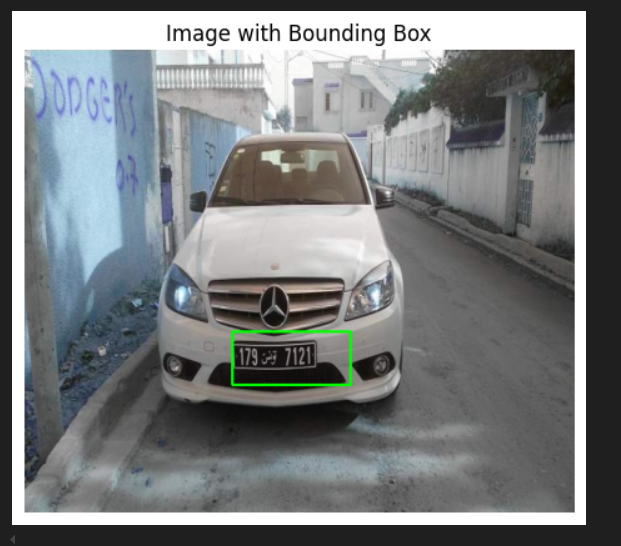

### Number plate detection 
-> used resnet50+custom layers  
-> Trasfer learning  
-> Tuned resnet50, some few last layers by unfreezing  
-> Predicted bouding boxes  

### Number detection
-> I used tesseract ocr to get the numbers from the cropped grayscaled image of number plate  
 

 

-> See \templ.ipynb and \tesseractocr.ipynb files for implementation  

-> you can check the models and data in the link given of my gdrive link: 
> https://drive.google.com/drive/folders/1DZrXUTulUR7H3sAdxY7nqXOHVAagzz9S?usp=drive_link